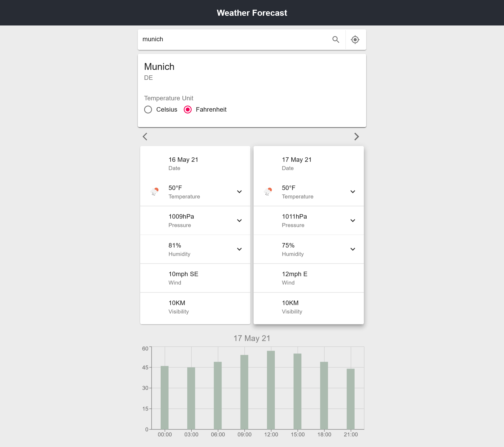

# [Weather Forecast App](https://weather-forecast-sooty.vercel.app/)

App created using React.js, Redux, Material UI, RTK Query, and Vite



### Commands

```
export VITE_OPENWEATHERMAP_API_KEY=API_KEY  // API KEY provided by openweathermap

yarn install  // Install dependencies

yarn dev      // Start development server

yarn build    // Build for production

yarn start    // Local preview of production build
```

### Features

- [x] Search by city
- [x] Search by current location (latitude, longitude)
- [x] Responsive UI
- [x] Data Caching
- [x] Error handling
  - [x] Client
  - [x] Server
- [x] Temperature Units
  - [x] Fahrenheit
  - [x] Celsius
- [x] Weather Cards Navigation
- [x] Weather Card created by date
- [x] Weather Card Selection
- [x] Nested list for weather data
- [x] Bar Chart
- [x] Live Preview

### Todos

- [ ] Set city by latitude, longitude
- [ ] Unit tests
- [ ] Weather Icons (wind, pressure etc.)
- [ ] Additional data (wind, pressure) in Bar Chart
- [ ] Sunrise, Sunset and Timezone in City Card
